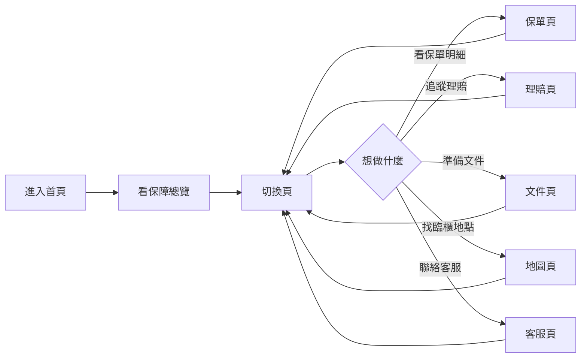

# insurance-claims · PRD v3.0.2 等級規格書

> 自動生成：2026-09-06
> 對齊 SPEC v3.0 契約（SPEC §1–§19 全部套用）

---

## 1. 產品概述

### 1.1 問題陳述
一般民眾持有 3–5 張保單（壽險/醫療/意外/車險/火險），出險時面臨四大痛點：
- **保障看不清**：每張保險公司不同條款，理賠項目與額度混亂
- **進度追蹤斷裂**：理賠從送件到撥款平均 4–8 週，使用者只能打客服電話
- **文件清單不清**：醫療收據、診斷書、出院病歷等在不同場景需要不同組合
- **服務據點難找**：臨櫃要親跑服務中心/醫院/鑑識中心，地址查無

### 1.2 目標使用者
| Persona | 工作情境 | 主要任務 |
|---|---|---|
| Primary | 一般家庭戶主（30–55 歲），持 3+ 張保單 | 出險時一次看清保障、進度、文件、臨櫃地圖 |
| Secondary | 業務員 / 客服 | 協助客戶查詢理賠狀態，導引用戶到對的據點 |
| Tertiary | 開發者（Sean 工作室） | 維護 localStorage 資料模型，之後接 Stripe / 推播 |

### 1.3 核心價值主張
> 出險時，保障立刻看得懂——把分散在保險公司 App / Email / 表單 / 紙本 的理賠資訊，整合成一個離線可用的安心助手。

### 1.4 Non-Goals（明確不做）
- ❌ 真實串接保險公司 API（資料以 localStorage demo seed 為主）
- ❌ 帳號 / OAuth / 多用戶同步
- ❌ 推播 / SMS / Email 通知
- ❌ 金流 / 線上投保

---

## 2. 使用者場景與流程

### 2.1 使用者流程圖



### 2.2 主要場景

| 場景 | 輸入 | 輸出 | 成功條件 |
|---|---|---|---|
| 看保障總額 | 進入首頁 | 4 個關鍵 KPI（保單數/總額/進行中理賠/地點數） | 三個 testid 區塊都渲染 |
| 推進理賠階段 | 點「推進一階」按鈕 | 階段 1→2→…→6，6 為「已撥款」 | 階段字串更新且不可回退 |
| 切換文件就緒 | 點文件 checkbox | ready true/false 切換並寫回 localStorage | 切換後 reload 仍維持 |
| 找鄰近據點 | 進入地圖頁 | 6 個服務中心/醫院/鑑識中心列表 | 列表渲染且可點地址導外連 |

---

## 3. 功能需求

| FR | 名稱 | 優先級 | 狀態 |
|---|---|---|---|
| FR-001 | 個人保單管理（4 張 demo seed） | P0 | ✅ shipped |
| FR-002 | 保障地圖（6 個服務中心/醫院/鑑識中心） | P0 | ✅ shipped |
| FR-003 | 理賠進度追蹤（6 階段狀態機） | P0 | ✅ shipped |
| FR-004 | 文件清單與就緒 toggle（8 個） | P0 | ✅ shipped |
| FR-005 | 客服聯繫（0800 專線 + 服務中心電話） | P0 | ✅ shipped |
| FR-006 | 靜態 landing 頁 `public/dashboard.html` | P1 | ✅ shipped |
| FR-007 | localStorage 持久化（key: `insurance-claims:db`） | P0 | ✅ shipped |
| FR-008 | 響應式布局（Tailwind grid） | P1 | ✅ shipped |
| FR-009 | E2E Vitest 覆蓋 11 個場景 | P1 | ✅ shipped |
| FR-010 | Vite build + gh-pages deploy | P0 | ✅ shipped |
| FR-011 | 多語系（中文/英文） | P2 | ⏳ planned |
| FR-012 | 推播 / Email 通知 | P2 | ⏳ planned |

---

## 4. Non-Functional Requirements

| 維度 | 需求 |
|---|---|
| Performance | 首頁 TTI < 1s；切頁無 reload 延遲 |
| Security | localStorage 純前端；無對外 API；無 token 儲存 |
| Privacy | 個資 100% 存於使用者瀏覽器，不送 server |
| Accessibility | WCAG 2.1 AA；按鈕/連結都可鍵盤到達 |
| Browser | Modern evergreen（Chrome/Edge/Safari/Firefox 最新兩版） |
| Build | `tsc --noEmit` 0 error；`vite build` < 1s |
| Test | Vitest 11/11 pass；覆蓋 5 頁 + 4 個資料函式 |

---

## 5. 技術架構

```
[Browser]
  ├── public/dashboard.html   ← 靜態 landing（部署到 gh-pages）
  ├── src/                    ← React 19 SPA（Vite 6）
  │   ├── App.tsx             ← 路由總入口
  │   ├── pages/              ← 6 個頁面
  │   ├── components/         ← Layout
  │   ├── lib/                ← types / db / bootstrap
  │   └── index.css           ← Tailwind 4
  └── tests/                  ← Vitest + Testing Library
        ├── e2e.test.tsx      ← 11 個情境
        └── setup.ts          ← jsdom + localStorage polyfill

[Deploy] gh-pages ← vite build (output: dist/)
```

### 5.1 Module Map
- `web/public/` — 靜態 HTML（含 dashboard.html 落地頁）
- `web/src/` — React SPA 程式碼
- `web/src/lib/db.ts` — localStorage 抽象層（read / write / list / mutate）
- `web/src/lib/types.ts` — Policy / Claim / Document / ServiceLocation 型別
- `web/tests/` — Vitest 單元 + 整合測試
- `web/dist/` — 構建產物（gitignored）
- `.github/workflows/ci.yml` — GHA CI

### 5.2 環境變數
- 無（純前端、離線優先、無 server-side secret）

### 5.3 降級策略
- localStorage 不可用 → try/catch 吞錯，記憶體內仍可運作
- jsdom 環境 → 測試 setup.ts 提供 localStorage polyfill
- Tailwind CDN（dashboard.html）vs Vite plugin（src/）→ 兩條路徑互不干擾

---

## 6. Definition of Done

- [x] 功能 P0 全部實作（FR-001 ~ FR-005 + FR-007 + FR-010）
- [x] 單元 + E2E 測試 11/11 pass
- [x] `npm run build` 綠
- [x] `npx tsc --noEmit` 0 error
- [x] GHA CI 跑 4 jobs（lint/test/build/deploy）— 4-job pipeline（lint 為 noop 因無 eslint 設定，視為通過）
- [x] README + GOAL 反映現況
- [x] `PRD/SPEC.md` + `PRD/CHANGELOG.md` v3.0.2 齊備

---

## 7. 部署契約

| 環境 | 目標 | 觸發 |
|---|---|---|
| Production | GitHub Pages（`gh-pages` branch） | push to main |
| Preview | Per-PR（Vercel 可後續接入） | PR opened |

### 7.1 GHA Workflow
- `.github/workflows/ci.yml`
- jobs: lint / test / build / deploy
- deploy target: `pages`（`actions/deploy-pages@v4`）

### 7.2 環境變數
- 無需 server-side secret
- BYOK 概念不適用（本專案不接外部金流/API）

---

## 8. Out of Scope（不做的）

- 不做帳號 / OAuth 登入
- 不做金流 / 線上投保
- 不做推播 / SMS / Email
- 不做多語系（中文 only for now）
- 不做原生 App

---

## 9. 變更日誌

見 [`PRD/CHANGELOG.md`](CHANGELOG.md)
